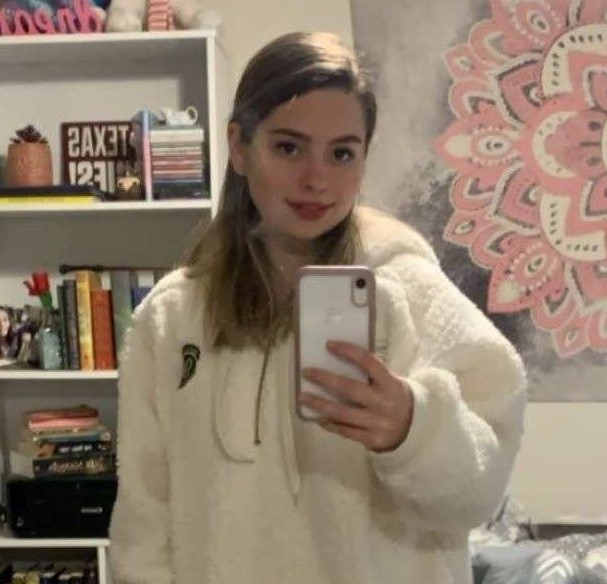
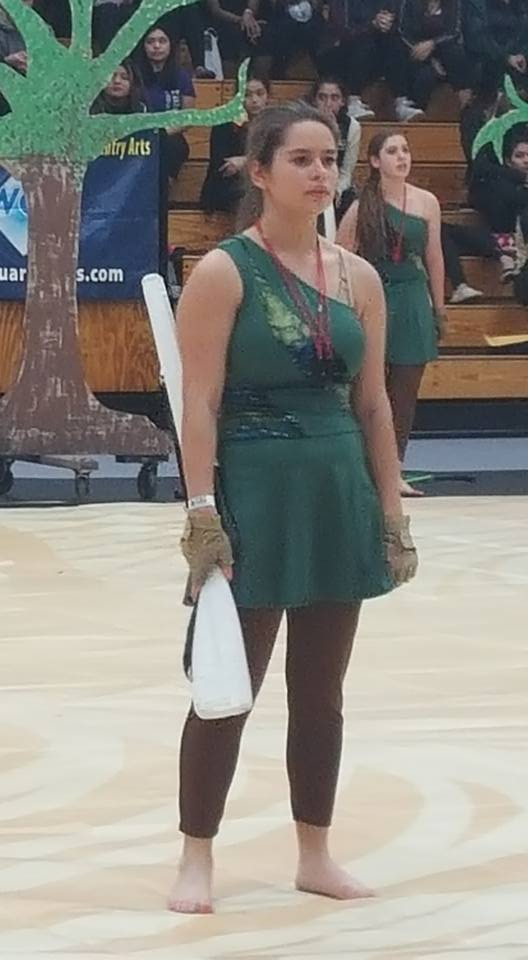
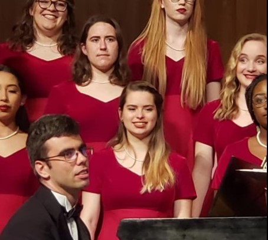

# This page is all about little old me!

Howdy! My name is Brandi and I am a senior English Major at Texas A&M University. I was born in Houston, TX but lived out 7 years of my life (between 2nd and 8th grade) in Fort Walton Beach, FL. I moved back to Texas before high school in order to live closer to family while my dad recovered from alcoholism as well as a saint-complex. I chose Texas A&M as my University because I originally wanted to be a veternarian (and because Baylor was way too expensive) but this did not work out because of my aversion to chemistry (or perhaps it was just my chemistry perfessor at A&M). Now I am slaveing my days away attempting to earn a degree in English so that I may one day be a teacher despite my less feasible dreams to read books all day long. 

---

Except (first paragraph) from a creative writing assignment I did a year ago:

>The young girl’s blood was saturated with endorphins and she looked as if she .honestly just wanted to scream. After ten years of dreaming and two of those years partaking in audition after audition, her work had finally amounted to something. In the freezing rain, underneath a graffiti filled metro-stop, she had finally received a call that would change my life. A call that saw her ?getting the main female role in a mainstream movie! Instead of hopping on the bus when it eventually squeaked into place behind the stop sign, she leaped into a puddle while walking back in the direction of her tiny one-bedroom apartment in order to tell someone the good news, even if it was just her cat Leo, who she had affectionately nicked-named Fluffy-Butt. The chilled water soaking through her socks and the bottom of her worn-out jeans woke her up from her hysteria almost immediately. 
>
>-Brandi Costello

---

My hobbies include procrastination and reading various types of books that do not include mystery. I also enjoyed participating my high school's Color Guard my Sophomore through Senior. <- (There was just so much fun to be had when tossing flags and rifles into the air with a possibility of a black eye. Despite this, it definitely allowed me to let out a lot of pint up aggression.) My cat, Leo, was and is my constant companion as well as pain in the butt through all of my adventures through the great state of Texas. In other words, he is an introverted lynx point siamese cat with an attitude problem. I also am almost obligatory to participate in any choir I have access to which includes Texas A&M's Womans Chorus, to which I am a current member.

---
Side Note: Here is a cute picture of a cat typing...

<iframe src="https://giphy.com/embed/LHZyixOnHwDDy" width="480" height="360" frameBorder="0" class="giphy-embed" allowFullScreen></iframe>
<a href="https://giphy.com/gifs/computer-working-cat-LHZyixOnHwDDy">via GIPHY</a>

---

Some things I am excited for include (Not in this order)

1. Chicken Wings
2. **Cats**
3. Books
4. Ranch
5. Chocolate Chip Cookies
6. Harry Potter
7. Stargate
8. Pasta
9. *Class Tomorrow*
10. TBC as life goes on...

---
And then a random music video that was saved on my YouTube playlist probably about 10 years ago...

<iframe width="560" height="315" src="https://www.youtube.com/embed/7jmSYbzmvSk" title="YouTube video player" frameborder="0" allow="accelerometer; autoplay; clipboard-write; encrypted-media; gyroscope; picture-in-picture" allowfullscreen></iframe>
